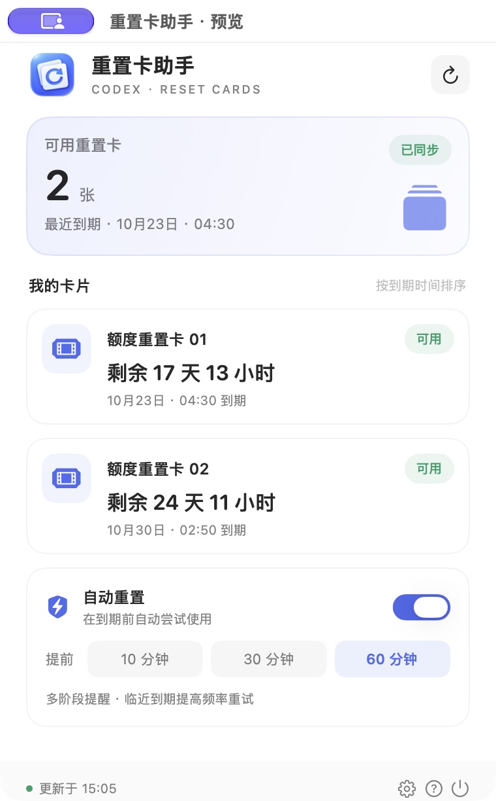
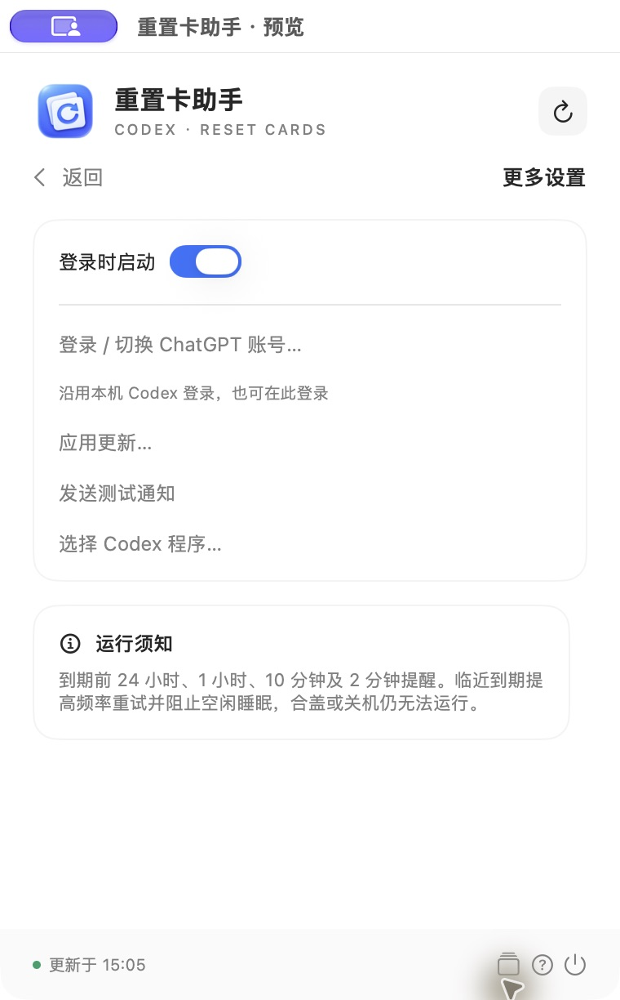

# ResetCardBar · Codex 重置卡助手

一个原生 macOS 菜单栏应用，用于查看 Codex 重置卡到期时间、提前提醒，并在临近到期时自动尝试使用。发布包内置官方 Codex App Server，可在应用内通过浏览器登录 ChatGPT；已有 Codex CLI 的用户可沿用本机账号，无需填写 API Key。

[下载最新版本](https://github.com/Jackzhang144/ResetCardBar/releases/latest) · [GitHub Actions](https://github.com/Jackzhang144/ResetCardBar/actions)

## 下载安装

1. 从 Release 下载通用 DMG，适用于 Apple Silicon 和 Intel、macOS 13 及以上。
2. 打开 DMG，将 ResetCardBar 拖入 Applications，再从 Applications 打开。
3. 首次打开如果被 macOS 阻止，通过「系统设置 → 隐私与安全性 → 仍要打开」按提示允许。当前版本未经过 Developer ID 签名与公证，不需要关闭 Gatekeeper。
4. 在设置页点击「登录 / 切换 ChatGPT 账号」，允许通知，并按需开启登录启动。

无需安装开发工具或 Homebrew。发布包含两个架构的官方运行组件，因此下载包较大。此应用是独立工具，不是 OpenAI 官方产品。

## 自动更新

设置 → 应用更新，可手动检查，也可分别控制「自动检查更新」和「自动安装并重启」。默认每小时自动检查，下载完成后验证 EdDSA 签名并安装重启。当前卡片操作未完成或卡片处于最后两分钟时，更新会等待。

更新异常不会中断重置卡监控。应用需安装在可写位置；权限不足时，系统可能要求管理员授权。首次安装的 1.4.x 版本没有更新功能，需要手动安装一次 1.5.0。

## 实际截图

以下截图于 2026-10-05 在 macOS 的真实运行窗口中采集。预览窗口与菜单栏弹出面板复用同一个 SwiftUI 界面；显示的数量和到期日期来自实际账号，未使用设计稿或生成图代替截图。

| 主面板 | 设置页 |
| --- | --- |
|  |  |

## 功能

- 菜单栏显示可用卡片数量，圆角卡片展示剩余时间和到期日期。
- 每页显示两张卡；后台处理全部已知卡片，主面板无需上下滚动。
- 自动使用提前时间可选 10、30、60 分钟，当前默认 60 分钟。
- 到期前 24 小时、1 小时、10 分钟、2 分钟分别提醒。
- 常态每 60 秒检查，最后 1 小时每 15 秒，最后 2 分钟或有待确认请求时每 5 秒。
- 原子保存使用记录；网络响应丢失后复用幂等标识确认结果。
- 网络恢复和系统唤醒后补查，临近到期时阻止空闲睡眠。
- 支持登录启动、通知测试，以及通知权限异常提示。
- 内置登录、签名更新与安全重启，提供 DMG / ZIP 通用发布包。

## 构建与运行

需要 macOS 13+、Xcode Command Line Tools、Python 3 和 `make`。可选安装完整 Xcode，以编译 `Assets.car`；没有完整 Xcode 时使用 `.icns` 图标。

```sh
make build
make test
```

应用生成在 `build/ResetCardBar.app`，默认构建本机架构，使用本地临时签名。Sparkle 固定版本及 SHA-256 下载校验。开发入口是命令行构建，仓库没有 Xcode 工程文件。

完整发布构建（同时内置两个架构的官方后端）：

```sh
RESETCARDBAR_ARCH=universal RESETCARDBAR_BUNDLE_CODEX=1 make test
```

普通开发构建不重新打包后端，可使用本机 Codex CLI；使用过完整发布构建时，已有后端可能留在本地构建目录。

先使用 ChatGPT 账号登录 Codex CLI：

```sh
codex login
codex login status
```

将应用复制到 `/Applications` 后运行：

```sh
ditto build/ResetCardBar.app /Applications/ResetCardBar.app
open /Applications/ResetCardBar.app
```

替换安装版前，从菜单退出正在运行的旧版本。允许通知后，在底部齿轮设置页发送测试通知，并按需开启登录启动。

默认先查找用户选择的程序和本机 CLI，其次使用发布包内置的 App Server；也可在设置页手动选择。CLI 和桌面应用登录账号不同时，以选中的后端登录账号为准。

## 开发命令

| 命令 | 用途 |
| --- | --- |
| `make build` | 构建并检查代码签名 |
| `make test` | 运行卡片边界、模拟监控和真实进程 RPC 测试；不消费真实卡片 |
| `make run` | 启动开发构建 |
| `make preview` | 打开同一界面的预览窗口，读取真实账号并沿用当前自动使用设置 |
| `make health` | 只读检查通知授权、待提醒数量和提前时间 |
| `make package` | 测试后生成 `dist/` 下的应用 ZIP |

已运行其他副本时，实例锁会阻止开发构建启动。需要预览时先从运行版菜单退出，再执行 `make preview`。完整开发流程见 [DEVELOPMENT.md](DEVELOPMENT.md)。

## 能力边界

自动使用需要应用运行、Mac 醒着并联网。空闲睡眠保护不能阻止合盖、主动睡眠或关机。应用没有独立崩溃重启守护进程；退出或崩溃后，自动使用会暂停，已安排的系统提醒仍由 macOS 管理。

服务端返回 `nothingToReset` 时会继续尝试，但应用不能强制创建可重置额度。接口未提供到期明细时也无法保证准确安排。不能承诺卡片绝不过期。

通知中心图标曾显示默认占位图，尚未确认修复；此问题不影响卡片查询和自动使用逻辑。

## 记录与隐私

使用记录位于 `~/Library/Application Support/ResetCardBar/state.json`，偏好域为 `local.jackzhang.ResetCardBar`。记录包含账号标识、卡片标识、到期时间和未确认请求，不包含登录凭据。登录由 Codex CLI 管理。

不要删除记录文件来解决重试异常，否则会丢失未确认请求的标识。不要提交真实账号响应、记录文件、登录凭据或调试日志。

## CI / CD

- `main` 的推送和 PR 在 Apple Silicon、Intel runner 上构建并运行离线测试。
- `v*` 标签先验证两种架构，再构建包含后端的通用包，生成 DMG / ZIP、签名 appcast 和 SHA256SUMS。
- 所有文件上传到草稿 Release 后才公开；已公开版本不被重复覆盖。
- `SPARKLE_PRIVATE_KEY` 仅存于本机钥匙串及仓库的 GitHub Actions secret；公钥写入应用。维护者发布流程见 [docs/RELEASING.md](docs/RELEASING.md)。

## 仓库与 Codex

```text
src/                  应用界面、RPC、调度与持久化监控
resources/            Info.plist
assets/               图标原图及生成说明
scripts/              构建、图标资源编译与打包脚本
tests/                模拟监控断言及 RPC 进程夹具
docs/                 架构、可靠性、截图和历史检查记录
.agents/skills/       仓库专用 Codex 开发 skill
build/、dist/          本地生成产物，不纳入 Git
```

Codex 入口为 [AGENTS.md](AGENTS.md)。仓库 skill 位于 [.agents/skills/reset-card-bar-dev/SKILL.md](.agents/skills/reset-card-bar-dev/SKILL.md)，在本仓库启动 Codex 后可用 `$reset-card-bar-dev` 调用，目录采用[官方 Codex skill 规范](https://learn.chatgpt.com/docs/build-skills)。

更多说明：[架构](docs/ARCHITECTURE.md) · [可靠性](docs/RELIABILITY.md) · [版本记录](CHANGELOG.md) · [官方 App Server 接口](https://learn.chatgpt.com/docs/app-server)

## 许可证

本项目采用 [MIT](LICENSE)。Sparkle 和内置 Codex 组件保留各自许可证；详见 [第三方组件](docs/THIRD_PARTY.md)。
