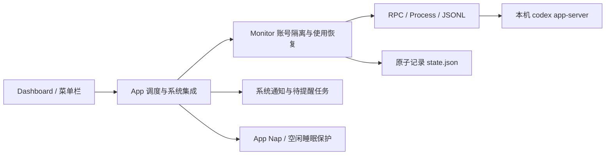

# 架构

应用通过 `Process` 启动本机 `codex app-server`，以换行 JSON 交换请求。每轮刷新建立一条连接，执行 `initialize` / `initialized` 握手；带 `id` 的响应与请求匹配，异步通知不被误当成响应。

`App` 负责主线程界面、串行工作队列、网络恢复、唤醒、定时器、系统通知及电源断言。`Monitor` 负责读取卡片、决定候选顺序、持久化幂等键、确认结果与生成通知事件。界面分页不参与自动使用决策。

主进程使用文件锁防止重复运行。RPC 每个请求超时 12 秒；输出关闭立即失败，关闭连接时终止子进程，必要时在两秒后强制结束仍存活的子进程。

## 数据

- `Card`：服务端卡片标识、状态、类型、到期 Unix 秒。
- `MonitorState`：当前账号以及按账号分开的记录。
- `AccountState`：已知卡片、待确认请求、已完成卡片、最近读取时间及通知 outbox。
- `Attempt`：同一次逻辑请求的幂等键和开始时间。

原子写入后同步文件，再发送消费请求。Codex 负责认证；本仓库不读取或保存 CLI 登录凭据。

## 接口契约

调用 `account/rateLimits/read` 获取数量与卡片明细；本机返回的 `accountId` 用于隔离记录。`availableCount` 权威，明细可以缺失或截断。卡片的 `expiresAt` 与额度窗口的 `resetsAt` 含义不同。

调用 `account/rateLimitResetCredit/consume` 时显式传入 `creditId` 和 `idempotencyKey`。`reset` / `alreadyRedeemed` 为成功；`nothingToReset` 是一次明确未成功的尝试，后续新尝试可生成新键；不确定响应保留原键。

当前运行结构与测试入口见 [开发指南](../DEVELOPMENT.md)。接口变更应核对[官方 App Server 文档](https://learn.chatgpt.com/docs/app-server)和已安装 CLI 生成的 schema，不能凭记忆扩展消费结果。
